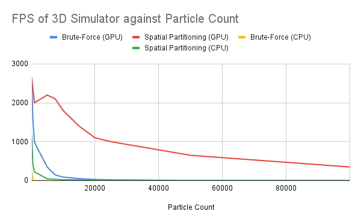

# 3D GPU Particle Simulator
A high-performance, GPU-accelerated 3D particle simulation written in modern C++ using OpenGL 4.6 compute shaders and SFML for input and window management. 
The simulator supports spatial partitioning and interactive camera controls for visualizing large-scale particle interactions.

## Features
- GPU-based particle simulation using OpenGL compute shaders
- All particles stored in GPU using a Shader Storage Buffer Object (SSBO)
- Spatial partitioning with uniform grid and cell hashing
- All spatially partitioned cells are stored in the GPU using SSBO
- Simple collision handling and particle repulsion
- Real-time rendering and camera controls (keyboard)
- SFML-based windowing and input management
  

## Requirements
Before building, make sure the following are installed:

### Compiler & Build Tools
- **[MSYS2](https://www.msys2.org/)** (recommended)
- Use `mingw64` environment (not `ucrt64` or `clang64`)
- `g++` (installed via `pacman -S mingw-w64-x86_64-gcc`)
- `make` (optional, for building with provided Makefile)

### Libraries
- **[SFML 2.6.1](https://www.sfml-dev.org/)** (installed via MSYS2)
```pacman -S mingw-w64-x86_64-sfml```

## Build Instructions
### Option 1: Using Makefile without make or SFML installed (MYSYS2 / MinGW64)
```pacman -S mingw-w64-x86_64-gcc mingw-w64-x86_64-sfml make```bash
```cd 3D-Particle-Simulator```bash
```make```bash

The executable will be placed in `/bin/`. DLLs will be copied automatically

### Option 2: SFML installed, but compiled without make
```g++ -std=c++17 -Wall -Iinclude -Iglm src/*.cpp src/gl.c -o bin/main.exe \ -L"C:/msys64/mingw64/lib" -lsfml-graphics -lsfml-window -lsfml-system -lopengl32```

## Run Instructions
``` ./bin/main.exe ``` 


## Controls
- `W/A/S/D` or arrow keys for movement
- `+/-` to zoom in/out

## Performance Comparison

Below is a benchmark comparing different implementations of the particle simulator

- **CPU with no spatial partitioning**
- **CPU with spatial partitioning**
- **GPU with no spatial partitioning**
- **GPU with spatial partitioning (current)**



## Notes
- Requires an OpenGL 4.6+ capable GPU
- Currently optimized for high particle count (100,000+)
- Make sure `glad` or your OpenGL loader is initialized correctly
- Particle logic is performed entirely on the GPU using compute shaders
